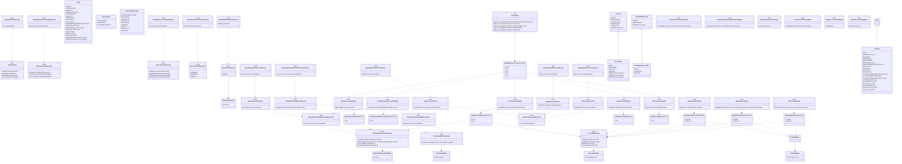

 

```mermaid
classDiagram
%% --kernel--
%% entities
class Account {
	UserId id
	Address address
	UserName name
	Password pass
	LoggedAt date
	VerrifiedAt verified_at
}
class NonVerifiedAccount {
	TicketId id
	Address address
	VerificationCode code
}
class Client {
	ClientId id
	ClientName name
	ClientUri uri
	ClientDescription desc
	ClientTypes types
	LogoUri logo
	TermsUri terms
	UserId owner
	policy PolicyUri
	TokenEndPointAuthMethod auth_method
	GrantTypes grant_types
	ResponseTypes renponse_types
	RedirectUris redirect_uris
	Scopes scoped
	Contacts contact
	Option~Jwks~ jwks
	RegistractionAccessToken conf_token
	RegistractionEndPoint conf_endpoint
}
class AccessToken {
	AccessTokenId id
	LoggedAt date
	AccessTokenContext ctx
}
class AccessTokenContext {
	Vec~ScopeMethod~ scope
	Client client_id
	UserId account
	Audience aud
	ExpiredIn exp
	IssuedAt iat
	Issuer iss
	NotBefore nbf
	Subject sub
}

%% repository
class AccountRepository {
	<<trait>>
	create(&self, &Account create)
	update(&self, &Account update)
	delete(&self, &UserId)
	
	find_by_id(&self, &UserId id)
}
class DependOnAccountRepository {
	<<trait>>
	account_repository(&self)
}
DependOnAccountRepository..>AccountRepository
class NonVerifiedAccountRepository {
	<<trait>>
	create(&self, &NonVerifiedAccount create)
	validation(&self, &TicketId coupon, &TickedId valid, &Address address)
	find_by_id(&self, &TickedId id)
	find_by_valid_id(&self, &TickedId id)
}
class DependOnNonVerifiedAccountRepository {
	<<trait>>
	non_verified_account_repository(&self)
}
DependOnNonVerifiedAccountRepository..>NonVerifiedAccountRepository
class ClientResistry {
	<<trait>>
	register(&self, &Client client)
	delete(&self, &ClientId id)
	update(&self, &Client client)
	
	find_by_id(&self, &ClientId id)
}
class DependOnClientResistry {
	<<trait>>
	client_registry(&self)
}
DependOnClientResistry..>ClientResistry
class AuthorizeTokenRepository {
	<<trait>>
	crete(&self, &AuthorizeToken create)
	delete(&self, &AuthorizeTokenId delete)
	find_by_id(&self, &AuthorizeTokenId id)
}
class DependOnAuthorizeTokenRepository {
	<<trait>>
	authorize_token_repository(&self)
}
DependOnAuthorizeTokenRepository..>AuthorizeTokenRepository
class AccessTokenRepository {
	<<trait>>
	create(&self, &AccessToken create)
	update(&self, &AccessToken update)
	delete(&self, &AccessTokenId delete)
	
	find_by_id(&self, &AccessTokenId id)
}
class DependOnAccessTokenRepository {
	<<trait>>
	access_token_repository(&self)
}
DependOnAccessTokenRepository..>AccessTokenRepository
class RefreshTokenRepository {
	<<trait>>
	create(&self)
	delete(&self)
	find(&self)
}
class DependOnRefreshTokenRepository {
	<<trait>>
	refresh_toen_repository(&self)
}
DependOnRefreshTokenRepository..>RefreshTokenRepository

%% transporter
class BlackListTransporter {
	<<trait>>
	pull(&self)
}
class DependOnBlacklistTransporter {
	<<trait>>
	blacklist_transporter
}
DependOnBlacklistTransporter..>BlackListTransporter
class VerificationMailTransporter {
	<<trait>>
	send(&self, &VerificationCode code, &Address address)
}
class DependOnVerificationMailTransporter {
	<<trait>>
	verification_mail_transporter(&self)
}
DependOnVerificationMailTransporter..>VerificationMailTransporter


%% --driver--
%% database
class AccountDataBase{
	Pool~Postgres~ pool
}
AccountRepository--*AccountDataBase
class NonverifiedAccountDataBase {
	Pool pool
}
NonVerifiedAccountRepository--*NonverifiedAccountDataBase
class ClientDataBase {
	Pool~Postgres~ pool
}
ClientRegistry--*ClientDataBase

%% transport
class BlacklistRepository {
	Client client
}
BlackListTransporter--*BlacklistRepository
class VerificationMailer {
	SmtpPool mailer
}
VerificationMailTransporter--*VerificationMailer


%% --application--
%% adapter
class CreateNonVerifiedAccountAdapter {
	<<trait>>
	create(&self, CreateNonVerifiedAccountDto create)
}
class ApproveAccountAdapter {
	<<trait>>
	approve(&self, &str id, &str code)
}
class CreateAccountAdapter {
	<<trait>>
	create(&self, &str id, CreateAccountDto create)
}
class UpdateAccountAdapter {
	<<trait>>
	update(&self, UpdateAccountDto update)
}
class DeleteAccountAdapter {
	<<trait>>
	delete(&self, &str pass, &Uuid delete)
}
class RegisterClientAdapter {
	<<trait>>
	register(&self, RegisterClienDto register)
}
class UpdateClientAdapter {
	<<trait>>
	update(&self, &Uuid id, &str cl_secret &str pass_phrase, UpdateClientDto update)
}
class DeleteClientAdapter {
	<<trait>>
	delete(&self, &Uuid uuid, &str cl_secret, &str pass_phrase)
}
class RestAdapter {
	<<trait>>
	prepare_user_verification(&self, CreateNonVerifiedAccountDto user)
	approve_account(&self, &str ticket, &str code)
	create_account(&self, &str ticket, CreateAccontDto create)
	update_account(&self, UpdateAccountDto  update)
	delete_account(&self, &str pass, &Uuid delete)
}
class CreateAuthorizeTokenAdapter {
	<<trait>>
	create(&self, &Uuid user, CreateAuthorizeTokenDto create)
}
class CreateAuthorizeTokenImplicitFlowAdapter {
	<<trait>>
	create(&self, &Uuid user, CreateAuthorizeTokenDto create)
}
class DeleteAuthorizeTokenAdapter {
	<<trait>>
	delete(&self, &str id)
}
class CreateAccessTokenAdapter {
	<<trait>>
	create(&self, CreateAccessTokenDto create)
}
class UpdateAccessTokenAdapter {
	<<trait>>
	update(&self)
}
class DeleteAccessTokenAdapter {
	<<trait>>
	delete(&self, &str id)
}
%% interactor
class CreateNonVerifiedAccountInteractor~T1, T2~ {
	T1 kvs
}
CreateNonVerifiedAccountAdapter--*CreateNonVerifiedAccountInteractor
CreateNonVerifiedAccountInteractor..>NonVerifiedAccountRepository
CreateNonVerifiedAccountInteractor..>VerificationMailTransporter
class ApproveAccountInteractor~T~ {
	T kvs
}
ApproveAccountAdapter--*ApproveAccountInteractor
ApproveAccountInteractor..>NonVerifiedAccountRepository
class CreateAccountInteractor~T1, T2~ {
	T1 repo
	T2 kvs
}
CreateAccountAdapter--*CreateAccountInteractor
CreateAccountInteractor..>AccountRepository
CreateAccountInteractor..>NonVerifiedAccountRepository
class UpdateAccountInteractor~T~ {
	T repo
}
UpdateAccountAdapter--*UpdateAccountInteractor
UpdateAccountInteractor..>AccountRepository
class DeleteAccountInteractor~T~ {
	T repo
}
DeleteAccountAdapter--*DeleteAccountInteractor
DeleteAccountInteractor..>AccountRepository
class RegisterClientInteractor~T1, T2~ {
	T1 registry
	T2 accounts
}
RegisterClientAdapter--*RegisterClientInteractor
RegisterClientInteractor..>ClientRegistry
RegisterClientInteractor..>AccountRepository
class UpdateClientInteractor~T1, T2~ {
	T1 registry
	T2 accounts
}
UpdateClientAdapter--*UpdateClientInteractor
UpdateClientInteractor..>ClientRegistry
UpdateClientInteractor..>AccountRepository
class DeleteClientInteractor~T1, T2~ {
	T1 registry
	T2 accounts
}
DeleteClientAdapter--*DeleteClientInteractor
DeleteClientInteractor..>ClientRegistry
DeleteClientInteractor..>AccountRepository
class RestInteractor~T1, T2, T3, T4, T5~ {
	T1 nvac
	T2 acv
	T3 acc
	T4 acu
	T5 acd
}
RestAdapter--*RestInteractor
RestInteractor..>CreateNonVerifiedAccountAdapter
RestInteractor..>ApproveAccountAdapter
RestInteractor..>CreateAccountAdapter
RestInteractor..>UpdateAccountAdapter
RestInteractor..>DeleteAccountAdapter
%% services
class CreateNonVerifiedAccountService {
	<<trait>>
	create(&self, CreateNonVerifiedAccountDto create)
}
CreateNonVerifiedAccountService..>DependOnNonVerifiedAccountRepository
CreateNonVerifiedAccountService..>DependOnVerificationMailTransporter
class DependOnCreateNonVerifiedAccountService {
	<<trait>>
	create_non_verified_account_service(&self)
}
DependOnCreateNonVerifiedAccountService..>CreateNonVerifiedAccountService
class ApproveAccountService {
	<<trait>>
	approve(&self, &str id, &str code)
}
ApproveAccountService..>DependOnNonVerifiedAccountRepository
class DependOnApproveAccountService {
	<<trait>>
	approve_account_service(&self)
}
DependOnApproveAccountService..>ApproveAccountService
class CreateAccountService {
	<<trait>>
	 create(&self, &str id, CreateAccountDto create)
}
CreateAccountService..>DependOnAccountRepository
CreateAccountService..>DependOnNonVerifiedAccountRepository
class DependOnCreateAccountService {
	<<trait>>
	create_account_service(&self)
}
DependOnCreateAccountService..>CreateAccountService
class UpdateAccountService {
	<<trait>>
	 update(&self, UpdateAccountDto update
}
UpdateAccountService..>DependOnAccountRepository
class DependOnUpdateAccountService {
	<<trait>>
	update_account_service(&self)
}
DependOnUpdateAccountService..>UpdateAccountService
class DeleteAccountService  {
	<<trait>>
	delete(&self, &str pass, &Uuid delete)
}
DeleteAccountService..>DependOnAccountRepository
class DependOnDeleteAccountService {
	<<trait>>
	delete_account_repository(&self)
}
DependOnDeleteAccountService..>DeleteAccountService
%% transfer
class AccountDto {
	Uuid id
	String address
	String name
	String pass
	OffsetDateTime updated_at
	OffsetDateTime created_at
	OffsetDateTime verified_at
}
Account<--AccountDto
class NonVerifiedAccountDto {
	String id
	String address
	String code
}
NonVerifiedAccount<--NonVerifiedAccountDto
class ClientDto {
	Uuid id
	OffsetDateTime id_iat
	String name
	String client_uri
	String description
	Option~String~ secret
	Option~OffsetDateTime~ secret_exp
	String logo_uri
	String tos_uri
	Uuid onwer_id
	String policy_uri
	TokenEndPointAuthMethodDto auth_method
	Vec~GrantTypeDto~ grant_types
	Vec~ResponseTypeDto~ response_types
	Vec~String~ redirect_uris
	Vec~ScopeDto~ scopes
	Vec~String~ contacts
	Option~JwksDto~ jwks
	String conf_access_token
	String conf_endpoint
}
Clinet<--ClientDto
```

